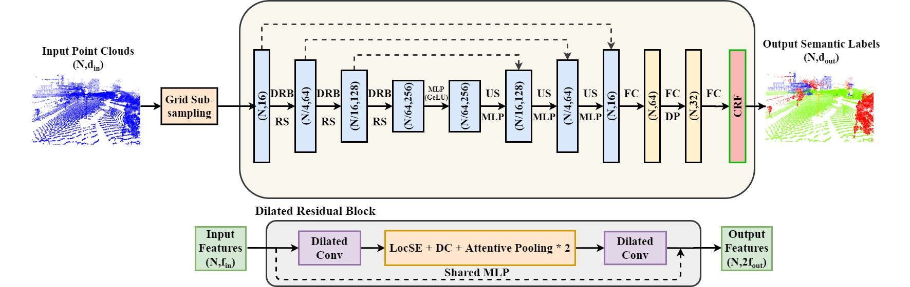
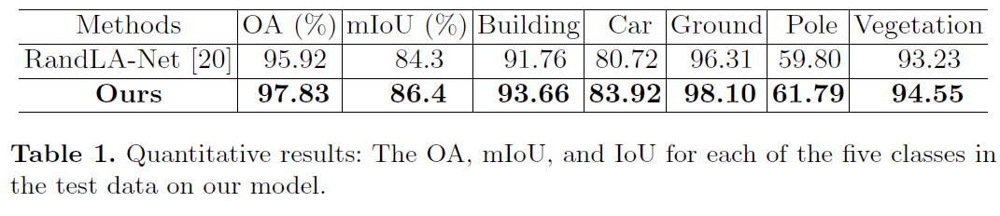
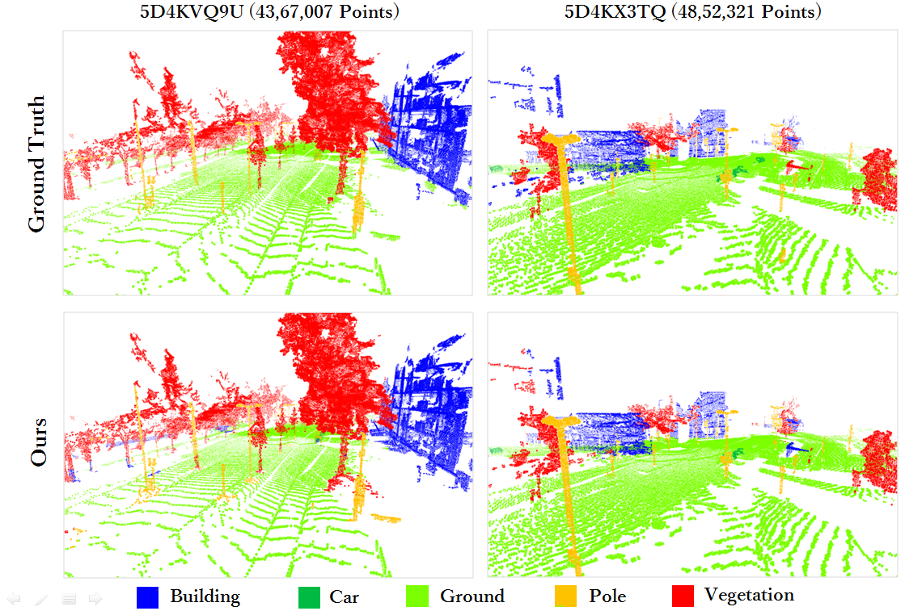
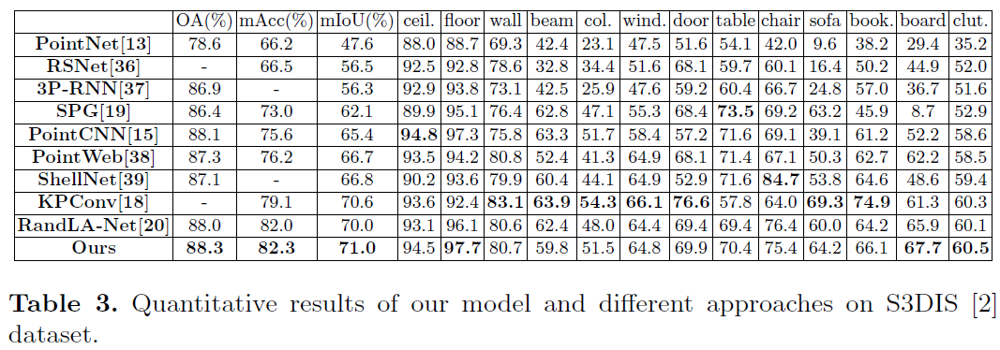

# GRanD-Net: 3D Point Cloud Semantic Segmentation for Large-Scale Scene Understanding
The official implementation of **GRanD-Net**

[Kiran Akadas](https://www.linkedin.com/in/kiran-akadas-0a744114a/), [Shankar Gangisetty](https://sites.google.com/site/shankarsetty/)

### This code has been tested with Python 3.5, Tensorflow 1.11, CUDA 9.0 and cuDNN 7.4.1 on Ubuntu 16.04



## Code (Tensorflow implementation)

Our [Tensorflow code](https://github.com/KiranAkadas/GRanDNet) is based on [RandLA-Net](https://github.com/QingyongHu/RandLA-Net/).  For copyright license, please check code base licenses. 

## Citation 

If you find GRandNet useful, please consider citing:

```
@InProceedings{Akadas_2020_ACCV,
    author    = {Akadas, Kiran and Gangisetty, Shankar},
    title     = {3D Semantic Segmentation for Large-Scale  Scene Understanding},
    booktitle = {Proceedings of the Asian Conference on Computer Vision (ACCV)},
    month     = {November},
    year      = {2020}
}
```

```
@article{KU202013,
title = "SHREC 2020: 3D point cloud semantic segmentation for street scenes",
journal = "Computers & Graphics",
volume = "93",
pages = "13 - 24",
year = "2020",
issn = "0097-8493",
doi = "https://doi.org/10.1016/j.cag.2020.09.006",
url = "http://www.sciencedirect.com/science/article/pii/S0097849320301400",
author = "Tao Ku and Remco C. Veltkamp and Bas Boom and David Duque-Arias and Santiago Velasco-Forero and Jean-Emmanuel Deschaud and Francois Goulette and Beatriz Marcotegui and Sebastián Ortega and Agustín Trujillo and José Pablo Suárez and José Miguel Santana and Cristian Ramírez and Kiran Akadas and Shankar Gangisetty",
keywords = "SHREC 2020, 3D point cloud, Semantic segmentation, Benchmark"
}
```

## Testing

1)Setup python environment:

```
conda create -n grandnet python=3.5
source activate grandnet
pip install -r helper_requirements.txt
sh compile_op.sh
```

2)Place all the files to be tested in the "data_test" folder

3)Prepare dataset

```
cd utils/
python data_prepare.py  		//(Change path strings if required)
cd ..
```

Note: If the file contains numbers that are too large. Use the Pre_normalize.py file to normalize the numbers before running the above commands.

4) Create "original_data" folder in the "data_test" folder and move all test files into it:

```
cd data_test/
mkdir original_data/
mv (all test_files) original_data
```

5) Now you have 3 folders in the "data_test" folder - original_data,original_ply,input_0.06/

6) The pre-trained model is stored in the "results" folder

7) To get the predictions for test files: (if required change the path strings in main_Semantic3D_test2.py)
```
python main_test.py --mode test --gpu 0 --model_path ./results/
```

8) The results/predictions are now stored in "test" folder.

9) To calculate mIoU :

Open calculate_miou.py and change the (Log_*_*) in the res_path string to point to Log directory in test folder which has predictions in test folder
Run 
```
python calculate_miou.py
```

10) Results are displayed and stored in log_MIOU.txt

## Results

Quantitative results on [SHREC 2020](https://kutao207.github.io/) dataset:



Qualitative results on SHREC 2020:



Quantitative results of different approaches on [S3DIS](https://docs.google.com/forms/d/e/1FAIpQLScDimvNMCGhy_rmBA2gHfDu3naktRm6A8BPwAWWDv-Uhm6Shw/viewform?c=0&w=1) dataset:


