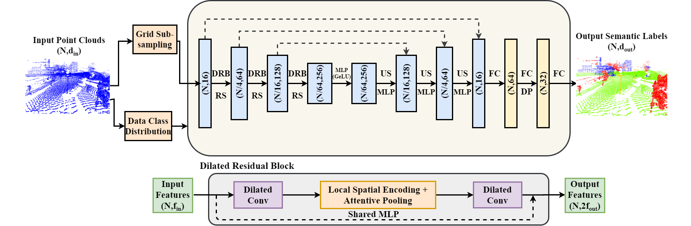

# GRanD-Net
The Official implementation of **GRanD-Net** (MLCSA2020), A large scale semantic segmentation architecture for point clouds

[Kiran Akadas](https://www.linkedin.com/in/kiran-akadas-0a744114a/), [Shankar Gangisetty](https://scholar.google.co.in/citations?user=Rjc90VIAAAAJ&hl=en)

### This code has been tested with Python 3.5, Tensorflow 1.11, CUDA 9.0 and cuDNN 7.4.1 on Ubuntu 16.04



## Code (Tensorflow implementation)

Our [Tensorflow code](/) is based on [RandLA-Net](https://github.com/QingyongHu/RandLA-Net/).  For copyright license, please check code base licenses. 

We took their code base and integrated our approach. Therefore, please, consider also citing or checking their work.

## Citation 

If you find GRandNet useful, please consider citing:

```
Coming soon
```
## Testing

1)Setup python environment:

```
conda create -n grandnet python=3.5
source activate grandnet
pip install -r helper_requirements.txt
sh compile_op.sh
```

2)Place all the files to be tested in the "data_test" folder

3)Prepare dataset

```
cd utils/
python data_prepare.py  		(Change path strings if required)
cd ..
```

Note: If the file contains numbers that are too large. Use the Pre_normalize.py file to normalize the numbers before running the above commands.

4) Create "original_data" folder in the "data_test" folder and move all test files into it:

```
cd data_test/
mkdir original_data/
mv (all test_files) original_data
```

5) Now you have 3 folders in the "data_test" folder - original_data,original_ply,input_0.06/

6) The pre-trained model is stored in the "results" folder

7) To get the predictions for test files: (if required change the path strings in main_Semantic3D_test2.py)

python main_test.py --mode test --gpu 0 --model_path ./results/

8) The results/predictions are now stored in "test" folder.

9) To calculate mIoU :

Open calculate_miou.py and change the (Log_*_*) in the res_path string to point to Log directory in test folder which has predictions in test folder
Run 
```
python calculate_miou.py
```

10) Results are displayed and stored in log_MIOU.txt
